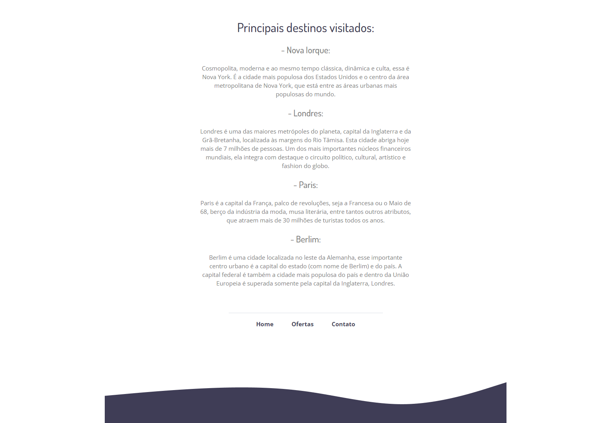

<h1 align="center"> Flutuar - Desafio extra do programa Explorer </h1>

O programa Explorer é um curso que visa ensinar programação e pessoas que nunca tiveram contato e desejam ingressar no mercado de trabalho. 
 

  <a href="#-tecnologias">Tecnologias</a>&nbsp;&nbsp;&nbsp;|&nbsp;&nbsp;&nbsp;
  <a href="#-descrição">Descrição</a>&nbsp;&nbsp;&nbsp;|&nbsp;&nbsp;&nbsp;
  <a href="#memo-licença">Licença</a>

  

## 🚀 Tecnologias

Esse projeto foi desenvolvido com as seguintes tecnologias:

- HTML
- CSS
- Figma
- Git e Github

## 💻 Descrição

Este projeto foi desenvolvido de acordo com o desafio extra proposto no programa Explorer. Nele, desenvolvi um site simples para treinar conceitos aprendidos
no programa. Contudo, fui além e desenvolvi outras páginas, para complementar e desenvolver ainda mais minhas habilidades e praticar os coneitos que aprendi.

 

Na página Home do projeto, temos uma simples página de introdução, contendo uma imagem, parágrafos e links para navegação entre as páginas.

  

 

Na página Destinos, há uma lista dos destinos mais requisitanos na empresa.

  

 

Já a página Ofertas apresenta uma lista de pacotes em ofertas juntamente com um link para mais informações.

  

 

> Já o link "Contato" abre o serviço de E-mail do usuário e permite contatar diretamente a empresa.

## :memo: Licença

Esse projeto está sob a licença MIT.

---
